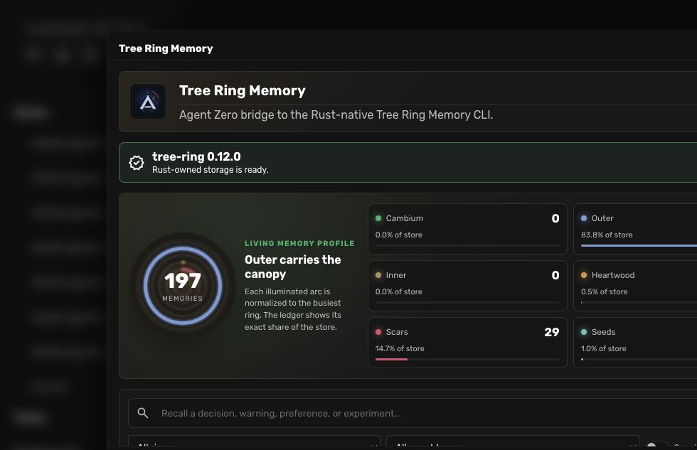

# Tree Ring Memory for Agent Zero

This plugin is an Agent Zero bridge to the Rust-native Tree Ring Memory CLI. Plugin version 3.0.0 targets the upstream `tree-ring` 0.13 command and JSON contracts; it does not maintain a second Python memory engine.

The Rust CLI owns validation, sensitivity classification, SQLite/FTS storage, recall ranking, import/export, audit, consolidation, maintenance, DOX/Revolve adapters, coordinated write authorization, and integration discovery. The plugin owns Agent Zero context mapping, tools, API envelopes, Web UI shaping, safe host paths, runtime status, and guarded migration.

## Install

In Agent Zero, open **Plugins → Install**, choose the Git repository option, and use:

```text
https://github.com/TerminallyLazy/tree-ring-memory-agent-zero
```

The installer clones this repository into `usr/plugins/tree_ring_memory`, then `hooks.py` validates the packaged CLI and initializes a new Rust store. Existing memory under `usr/memory/tree_ring_memory` is preserved across updates and uninstall. An unversioned v0.12 or versioned schema-v1/v2 Rust store is detected before the CLI can open it and waits for the explicit offline schema-v3 workflow below. The community marketplace entry uses the same repository and manifest.

## Requirements

- Agent Zero with this directory mounted at `/a0/usr/plugins/tree_ring_memory/`.
- An executable `tree-ring` 0.13.x binary. The plugin requires at least 0.13.0 and fails closed on other minor versions. Release builds bundle Linux binaries for Agent Zero's `x86_64` and `aarch64` Docker runtimes.
- Python 3.12+ in the Agent Zero framework runtime.

Binary discovery order:

1. `TREE_RING_MEMORY_CLI` or `cli.binary`.
2. `/a0/usr/plugins/tree_ring_memory/bin/linux-<architecture>/tree-ring`.
3. `/a0/usr/plugins/tree_ring_memory/bin/tree-ring` for an operator-supplied generic fallback.
4. `<memory-root>/bin/tree-ring`.
5. `tree-ring` on the framework runtime `PATH`.

Readiness is visible in the plugin settings and Tree Ring Memory dashboard. There is no manual Execute step.

Published Linux binaries are built from the exact upstream v0.13.0 tag in matching Rust Linux environments. Operators on another platform can use Tree Ring's official installer or build from source, then configure `cli.binary` or place the executable at `usr/plugins/tree_ring_memory/bin/tree-ring`.

The install hook selects only the executable already packaged for the running Docker architecture; it does not download or build executable code. Any replacement binary remains an explicit operator action.

## Storage

The default memory root remains:

```text
/a0/usr/memory/tree_ring_memory/
```

The current Rust-owned database is:

```text
/a0/usr/memory/tree_ring_memory/memory.sqlite
```

The Python-v1 database is preserved as read-only migration input:

```text
/a0/usr/memory/tree_ring_memory/indexes/memory.sqlite
```

Uninstall preserves both stores. Removing the memory root remains a deliberate operator action outside automatic plugin lifecycle handling.

## v0.13 Schema-v3 Upgrade

The plugin never lets a v0.13 CLI auto-open an existing unversioned v0.12 or versioned schema-v1/v2 store. The dashboard and settings report `upgrade_required` while normal store operations remain blocked.

Treat the upgrade as an offline, one-way operation:

1. Stop every Tree Ring CLI, plugin, TUI, and worker using the memory root.
2. In plugin settings, choose **Create verified upgrade backup** and attest that the root is offline.
3. The helper checkpoints and truncates SQLite WAL, acquires the database lock, verifies `PRAGMA integrity_check`, creates an exact mode-`0600` database backup under `<memory-root>/migrations/`, verifies SHA-256 and record count, and writes a mode-`0600` marker.
4. Choose **Apply schema v3** while every other process remains stopped. The plugin rechecks the source and backup checksums before allowing `tree-ring init` to migrate.
5. Upgrade every other CLI, plugin, and bundled worker before reopening the shared root.

If the source changes after backup, application fails closed and requires a fresh backup. Do not run v0.12 against an upgraded root. Schema v3 fences old memory inserts, updates, and deletes, but all mixed-version use—including reads and maintenance—is unsupported. Rollback means stopping every process and restoring the recorded complete backup; it is not a down-migration.

## Legacy Migration

Legacy Python-v1 migration never edits or deletes the old SQLite database. The migrator reads `raw_json`, normalizes Python-v1 null/string and `chat`-scope differences, writes a mode-`0600` temporary JSONL file, validates that file with `tree-ring import --dry-run`, and only then imports it through the Rust CLI. The temporary file is removed after the attempt.

Migration is idempotent. A marker under `<memory-root>/migrations/` prevents accidental repeats, while the Rust importer skips duplicate IDs by default. The original legacy database remains available as read-only recovery input. Automatic durable import occurs only while the Rust store policy is `open`; in `coordinated` mode the bridge performs only the dry-run preview until an authorized coordinator profile explicitly confirms migration.

## Multi-Agent and Coordinator Mapping

Every Agent Zero tool invocation derives its Tree Ring identity from the live server-side Agent Zero context:

- `agent_profile` comes from the active Agent Zero profile, with the Agent Zero name as a fallback.
- `project` comes from the active Agent Zero project.
- `session_id` is the current chat or worker context.
- `workflow_id` is the parent context for parallel fan-out workers and otherwise the current context.
- `operation_id` and `source_ref` are explicit tool inputs and are forwarded unchanged so a retry can reuse the same logical write identity and provenance.

The caller cannot set write identity through API payload fields. Recall can intentionally request a wider fan-in view with `include_all_agents=true`; that suppresses the current context's default agent/session filters while preserving any explicit agent, workflow, session, or scope filters.

Every subprocess starts from a copy of the host environment with `TREE_RING_COORDINATOR_TOKEN` and all Tree Ring identity environment variables removed. A coordinator capability is reinserted only when both conditions hold:

1. the operation is a protected mutation; and
2. the server-derived Agent Zero profile appears in `coordination.coordinator_profiles`.

The capability remains host-environment-only. It is not accepted by tools or API payloads, stored in plugin configuration, logged, returned, or rendered in the Web UI. Policy enable/rotate/disable and the one-time capability stay operator-only CLI actions. The plugin exposes only read-only `policy_status` and `policy_audit`.

Ordinary memories default to `scope=agent`, carry the derived identity, and do not receive the capability. In coordinated mode, shared/global/project/workflow writes, heartwood creation, evidence publication, persisted consolidation or adapter sync, imports, replacements, ring changes, delete/redact, and applied maintenance require coordinator authorization.

This is operational write authorization for cooperative official processes sharing one local SQLite store on one host. It is not a read ACL, an operating-system boundary, distributed coordination, or a cross-host/network-filesystem guarantee.

## Agent Tools

- `remember`: concise agent-scoped memory with server-derived identity plus optional `operation_id` and `source_ref`.
- `evidence`: evaluated outcomes with a required evidence reference.
- `recall`: Rust-ranked recall with native project/agent/workflow/session/scope filters and optional Agent Zero ring/event post-filters.
- `forget`: explicit-ID delete or redact.
- `consolidate`: daily, weekly, monthly, yearly, or manual consolidation.
- `audit_memory`: non-mutating quality, privacy, and integrity audit.
- `maintain_memory`: dry-run maintenance or explicit expiry/redaction/FTS repair.
- `sync_dox`: DOX source adapter; dry-run by default.
- `sync_revolve`: Revolve evidence adapter; dry-run by default.
- `import_memory`: dry-run by default, with optional duplicate replacement.
- `export_memory`: canonical JSONL export.
- `policy_status`: read-only coordinated-policy status.
- `policy_audit`: read-only protected-write authorization decisions.

The v0.13 CLI does not expose query-wide forget, selected-memory export, Markdown/SQLite export, expiry, or supersession as scriptable commands. The plugin returns an explicit unsupported-operation error for those former Python-v1 surfaces.

## Web UI



The panel provides runtime/schema readiness, write-policy status, search, ring/event filters, memory detail, ring-derived copies, delete/redact, consolidation, safe DOX/Revolve previews, memory and policy audit, and canonical JSONL export. Its concentric Tree Ring visual illuminates each ring relative to the busiest ring, while the adjacent ledger shows exact record counts and share of the store; selecting a ring filters the live results. The settings view also owns the explicit two-step schema upgrade and the non-secret coordinator-profile allowlist.

When the CLI is missing or incompatible, the panel stays available and shows the concrete readiness error instead of initializing a second store.

## Lifecycle and Maintenance

`hooks.py` owns automatic setup. Its install hook is idempotent, and Agent Zero runs it after both fresh installs and updates. The configuration hook provides a second idempotent bootstrap path after an update so older installations cannot remain dependent on the removed `execute.py` script. An unversioned v0.12 or versioned schema-v1/v2 preflight returns without opening the database. Before later updates, the hook exports an initialized compatible store as a recovery snapshot.

Interactive audit, consolidation, FTS repair, DOX/Revolve previews, import preview, and export remain available through the Web UI and Agent Zero tools. Sensitive recall and export remain opt-in. DOX `AGENTS.md`, Revolve evidence, current source, tests, and explicit user instructions remain authoritative over recalled memory.

## Verification

Focused tests use temporary roots and make no network calls. Set `TREE_RING_MEMORY_CLI` to include the real Rust round trip:

```bash
TREE_RING_MEMORY_CLI=/path/to/tree-ring \
PYTHONPATH="$PWD" \
PYTHONDONTWRITEBYTECODE=1 \
python3 -m pytest -q -p no:cacheprovider usr/plugins/tree_ring_memory/tests

node --check usr/plugins/tree_ring_memory/webui/memory-store.js
```

For upstream certification, put the freshly built `target/release/tree-ring` on `PATH` and set `TREE_RING_AGENT_ZERO_ROOT` to this Agent Zero checkout.

## Contribution Boundary

Keep implementation under `usr/plugins/tree_ring_memory/` and the companion guidance under `usr/skills/tree-ring-memory/`. Do not modify Agent Zero core code for this integration. If upstream changes its CLI or JSON schema, update the adapter and version gate together, then rerun the real CLI and legacy-copy proofs before changing the supported series.
